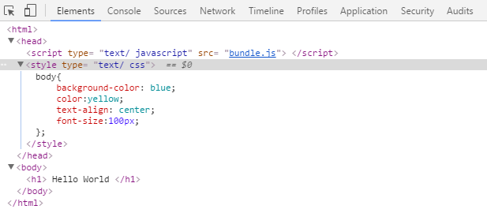
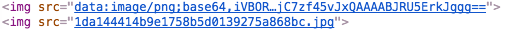

# 目录

- [安装](#安装)
  - [安装Node.js](#安装Node.js)
  - [安装package.json](#安装package.json)
  - [安装webpack](#安装webpack)
- [webpack第一个例子](#demo01)
- [功能介绍](#功能介绍)
  - [Loaders](#Loaders)
    - [Babel](#Babel)
    - [CSS加载](#CSS加载)
    - [图片加载](#图片加载)
    - [CSS组件加载](#CSS组件加载)
  - [UglifyJs插件](#UglifyJs插件)
  - [HTML Webpack Plugin](#HTML Webpack Plugin)
  - [环境变量](#环境变量)
  - [代码分割](#代码分割)
  - [用bundle-loader分割代码](#用bundle-loader分割代码)
  - [CommonsChunkPlugin](#CommonsChunkPlugin)
  - [Vendor chunk](#Vendor chunk)
    - [每个模块中使用jQuery](#每个模块中使用jQuery)
  - [暴露全局变量](#暴露全局变量)
  - [模块热替换(Hot Module Replacement)](#模块热替换(Hot Module Replacement))
  - [ExtractTextPlugin](#ExtractTextPlugin)

## 安装
### 安装Node.js
Node.js 自带了软件包管理器 npm。首先用`npm -v`查看是否安装了Node.js。没有的话，先从网上下载并安装。[https://nodejs.org/en/download/](https://nodejs.org/en/download/)<br>
点击开始--运行--cmd，输入`node --version`可以检查Node.js版本。<br>
### 安装[package.json](http://javascript.ruanyifeng.com/nodejs/packagejson.html)<br>
```bash
$ npm init      #生成package.json文件
```
### 安装webpack
#### 全局安装
```bash
$ npm install webpack -g
```
#### 本地安装
```bash
$ npm install webpack --save-dev
```

`--save` 通过这个参数，将保存配置信息至package.json（package.json是node.js项目配置文件）<br>
`--save-dev` 保存至package.json的devDependencies属性，不指定-dev将保存至dependencies属性。<br>
（dependencies字段指定了项目运行所依赖的模块，devDependencies指定项目开发所需要的模块。）

**安装指定版本**，命令如下：

```bash
$ npm install webpack@2.2.0-rc.3
```

webpack简单点来说就是一个配置文件，这个配置文件主要分为三大块:

- `entry` 入口文件 让webpack用哪个文件作为项目的入口
- `output` 出口 让webpack把处理完成的文件放在哪里
- `module` 模块 要用什么不同的模块来处理各种类型的文件

## demo01
index.html

```html
<html>
	<head>
	    <title>webpack demo01</title>
	</head>
	<body>
	    <script type="text/javascript" src="bundle.js"></script>
	</body>
</html>
```

main.js

```javascript
document.write('<h1>hello world</h1>');
```

webpack.config.js

```javascript
module.exports = {
    entry: './main.js',
    output:{
        filename: 'bundle.js'
    }
};
```

3个文件放到[demo01](./demo01)文件夹中后，点击index.html没有任何内容出现
### 运行命令

```bash
$ webpack
//文件夹中生成bundle.js文件,点击index.html,可在浏览器中看到"hello world"
```

## 功能介绍
### Loaders
通过使用不同的loader，webpack通过调用外部的脚本或工具可以对各种各样的格式的文件进行处理，比如说分析JSON文件并把它转换为JavaScript文件，或者说把下一代的JS文件（ES6，ES7)转换为现代浏览器可以识别的JS文件。或者说对React的开发而言，合适的Loaders可以把React的JSX文件转换为JS文件。[http://webpackdoc.com/loader.html](http://webpackdoc.com/loader.html)

Loaders需要单独安装并且需要在webpack.config.js下的modules关键字下进行配置，Loaders的配置选项包括以下几方面：
* test：一个匹配loaders所处理的文件的拓展名的正则表达式（必须）
* loader：loader的名称（必须）
* include/exclude：手动添加必须处理的文件（文件夹）或屏蔽不需要处理的文件（文件夹）（可选）；
* query：为loaders提供额外的设置选项（可选）

### Babel
Babel是一个编译JavaScript的平台，它的作用：
* 下一代的JavaScript标准（ES6，ES7），这些标准目前并未被当前的浏览器完全的支持；
* 使用基于JavaScript进行了拓展的语言，比如React的JSX

Babel其实是几个模块化的包，其核心功能位于称为babel-core的npm包中，不过webpack把它们整合在一起使用，但是对于每一个你需要的功能或拓展，你都需要安装单独的包（用得最多的是解析Es6的babel-preset-es2015包和解析JSX的babel-preset-react包）。

[demo02](./demo02)

index.html

```html
<html>
	<head>
	    <title>webpack demo02 Babel</title>
	</head>
	<body>
	    <div id="wrapper"></div>
	    <script type="text/javascript" src="bundle.js"></script>
	</body>
</html>
```

main.`jsx`

```javascript
const React = require('react');
const ReactDOM = require('react-dom');

ReactDOM.render(
    <h1>Hello, world!</h1>,
    document.querySelector('#wrapper')     //将h1标题插入#wrapper节点
);
```

webpack.config.js

```javascript
module.exports = {    
    entry: './main.jsx',
    output: {
        filename: 'bundle.js'
    },
    module: {
        loaders: [
            {
                test: /\.jsx?$/,
                exclude: /node_modules/,
                loader: 'babel',    //.jsx文件使用babel处理
                query: {
                    presets: ['es2015', 'react']
                }
            }
        ]   
    }
};
```
需安装多个依赖包：
```
$ npm install --save babel-core babel-loader babel-preset-es2015 babel-preset-react react react-dom
```

### CSS加载
webpack提供两个工具处理样式表，css-loader 和 style-loader，二者处理的任务不同，css-loader使你能够使用类似@import和 url(...)的方法实现 require()的功能,style-loader将所有的计算后的样式加入页面中，二者组合在一起使你能够把样式表嵌入webpack打包后的JS文件中。

[demo03](./demo03)

main.js

```javascript
require('./app.css');
```

app.css

```css
body{
	background-color: blue;
	color:yellow;
	text-align: center;
	font-size:100px;
};
```

index.html

```html
<html>
	<head>
		<script type="text/javascript" src="bundle.js"></script>
	</head>
	<body>
		<h1>Hello World</h1>
	</body>
</html>
```

webpack.config.js

```javascript
module.exports = {
    entry: './main.js',
    output: {
      filename: 'bundle.js'
    },
    module: {
      loaders:[
        { test: /\.css$/, loader: 'style-loader!css-loader' },
      ]
    }
};
```

安装依赖：

```
$ npm install --save css-loader style-loader
```

运行webpack,打开index.html页面，可以看到style-loader将css样式以嵌入式插入页面，见下图：  



### 图片加载
见[demo04](demo04)

index.html

```html
<html>
	<body>
		<script type="text/javascript" src="bundle.js"></script>
	</body>
</html>
```
main.js

```javascript
var img1= document.createElement("img");
img1.src=require("./small.jpeg");
document.body.appendChild("img1");

var img2= document.createElement("img");
img2.src=require("./big.jpg");
document.body.appendChild("img2");
```

webpack.config.js

```javascript
module.exports = {
	entry: './main.js',
	output: {
		filename: 'bundle.js'
	},
	module:{
		loaders:[
			{ test:/\.(jpeg|jpg)$/,loader:'url-loader?limit=8192' }
		]
	}
};
```
安装依赖`url-loader`和`file-loader`：
```
$ npm install url-loader file-loader --save
```
`'url-loader?limit=8192'`表示：当图片小于8192bytes即8KB时，会将图片生成为`data:image/png;base64,`base64图片。<br>
demo04中，原本有small.png和big.jpg两张图片，运行webpack后，big.jpg生成了`1da144414b9e1758b5d0139275a868bc.jpg`。

打开index.html，可以看到两张图片不同的加载方式。


### CSS组件加载
[CSS Modules用法教程参考](http://www.ruanyifeng.com/blog/2016/06/css_modules.html)

CSS的规则都是全局的，任何一个组件的样式规则，都对整个页面有效。

产生局部作用域的唯一方法，就是使用一个独一无二的`class`的名字，不会与其他选择器重名。这就是 CSS Modules 的做法。

CSS Modules 允许使用`:global(.className)`的语法，声明一个全局规则。凡是这样声明的class，都不会被编译成哈希字符串。

[demo05](./demo05)

app.css

```css
.h1 {color:red; }      /*局部，style.h1被编译成一个哈希字符串，成为一个独一无二的class名字*/
:global(.h2) {color: blue; }      /*全局*/
```

index.html

```html
<html>
	<body>
	    <div id="example"></div>
	    <script src="./bundle.js"></script>
	</body>
</html>
```

main.jsx

```
var React = require('react');
var ReactDOM = require('react-dom');
var style = require('./app.css');
ReactDOM.render(
  <div>
    <h1 className={style.h1}>Hello World</h1>
    <h2 className="h2">Hello Webpack</h2>
  </div>,
  document.getElementById('example')
);
```

webpack.config.js

```javascript
module.exports={
	entry:'./main.jsx',
	output: {
		filename:'bundle.js'
	},
	module:{
		loaders:[
			{
				test: /\.jsx?$/,
				loader: 'babel-loader',
				exclude: /node_modules/,
				query: {
					presets: ['es2015','react']
				}
			},
			{
				test: /\.css$/,
				loader: 'style-loader!css-loader?modules'
			}	
		]
	}
}
```
上面代码中，`style-loader!css-loader?modules`，它在`css-loader`后面加了一个查询参数`modules`，表示打开CSS Modules 功能。

### UglifyJs插件
Loaders和Plugins常常被弄混，但是他们其实是完全不同的东西，可以这么来说，loaders是在打包构建过程中用来处理源文件的（JSX，Scss，Less..），一次处理一个，插件并不直接操作单个文件，它直接对整个构建过程起作用。

Webpack有很多内置插件，同时也有很多第三方插件，可以让我们完成更加丰富的功能。

`UglifyJsPlugin 是内置插件，用来压缩JS代码。`[demo06](./demo06)

index.html

```html
<html>
	<body>
	  <script src="bundle.js"></script>
	</body>
</html>
```

main.js

```javascript
var longVariableName = 'Hello';
longVariableName += ' World';
document.write('<h1>' + longVariableName + '</h1>');
```

webpack.config.js

```javascript
var webpack=require('webpack')
module.exports={
	entry:'./main.js',
	output:{
		filename:'bundle.js'
	},
	plugins:[
		new webpack.optimize.UglifyJsPlugin({
			compress:{
				warnings:false
			}
		})
	]
};
```
运行后，UglifyJsPlugin将`main.js`输出压缩版本的`bundle.js`。

### HTML Webpack Plugin
这个插件的作用是依据一个简单的模板，创建出Html5文件，这个文件中自动引用了你打包后的bundle.js文件。[demo07](./demo07)

#### 安装
```
$ npm install html-webpack-plugin --save
```

main.js

```javascript
document.write('<h1>Hello World</h1>');
```

webpack.config.js

```javascript
var HtmlwebpackPlugin = require('html-webpack-plugin');
module.exports = {
    entry: './main.js',
    output: {
        filename: 'bundle.js'
    },
    plugins: [
        new HtmlwebpackPlugin({
        	title:'webpack demo'
        })
    ]
};
```
new HtmlwebpackPlugin()中可以配置：

`title`: 用于生成的HTML文件的标题。

`filename`: 用于生成的HTML文件的名称，默认是index.html。

然后运行webpack，生成index.html和bundle.js文件。

### 环境变量
只有在开发环境中使用环境变量，才能使某些代码起作用。

#### 关于webpack-dev-server:
如果是本地安装，每次运行时需输入路径调用，如：`./node_modules/.bin/webpack-dev-server`

可以在package.json中的`"scripts"`处配置如下：
```json
"scripts": {
    "dev": "webpack-dev-server --devtool eval --progress --colors"
}
```
然后运行：
```
$ npm run dev
```
这样就可以省去输入前面的复杂路径。注意node_modules和package.json需跟index.html在同一级。

[demo08](./demo08)配置如下：
```json
"scripts": {
    "dev": "set DEBUG=true && webpack-dev-server --devtool eval --progress --colors"
}                 //注意要加&&
```

main.js

```javascript
document.write('<h1>Hello World</h1>');

if (__DEV__) {
  document.write(new Date());
}
```

index.html

```html
<html>
	<body>
	  <script src="bundle.js"></script>
	</body>
</html>
```

webpack.config.js

```javascript
var webpack = require('webpack');
var devFlagPlugin = new webpack.DefinePlugin({
    __DEV__: JSON.stringify(JSON.parse(process.env.DEBUG || 'false'))
});

module.exports = {
    entry: './main.js',
    output: {
      filename: 'bundle.js'
    },
    plugins: [devFlagPlugin]
};
```

通过环境变量来运行`webpack-dev-server`命令(全局安装时)
```bash
# Linux & Mac
$ env DEBUG=true webpack-dev-server

# Windows
$ set DEBUG=true
$ webpack-dev-server
```

### 代码分割
构建大型应用的时候，你需要将你的代码分模块，不然你的js越来越大，加载速度越来越慢，分块也适合项目模块化，多人共同应用开发。webpack可以帮助我们将代码分成不同的逻辑块，在需要的时候加载这些代码。

[demo09](./demo09)用的是CommonJs的加载方式`require.ensure`。
#### require.ensure：
`说明`：require.ensure在需要的时候才下载依赖的模块，当参数指定的模块都下载下来了（下载下来的模块还没执行），便执行参数指定的回调函数。require.ensure会创建一个chunk，且可以指定该chunk的名称，如果这个chunk名已经存在了，则将本次依赖的模块合并到已经存在的chunk中，最后这个chunk在webpack构建的时候会单独生成一个文件。

`语法`：`require.ensure(dependencies: String[], callback: function([require]), [chunkName: String])`
* `dependencies`: 依赖的模块数组
* `callback`: 回调函数，该函数调用时会传一个require参数
* `chunkName`: 模块名，用于构建时生成文件时命名使用

`注意点`：require.ensure的模块只会被下载下来，不会被执行，只有在回调函数使用require(模块名)后，这个模块才会被执行。<br>
[require.ensure理解参考](http://www.cnblogs.com/3body/p/6143032.html)

main.js

```javascript
require.ensure(['./a'], function(require) {
  var content = require('./a');
  document.open();
  document.write('<h1>' + content + '</h1>');
  document.close();
});
```

`require.ensure`告诉webpack，`./a.js`和`bundle.js`分离，并且将依赖的模块放到chunk中。

a.js

```javascript
module.exports = 'Hello World';
```

index.html

```html
<html>
  <body>
    <script src="bundle.js"></script>
  </body>
</html>
```

webpack.config.js

```javascript
module.exports = {
  entry: './main.js',
  output: {
    filename: 'bundle.js'
  }
};
```

运行：
```bash
$ webpack-dev-server
```
表面上没什么变化，但是，webpack将`main.js`和`a.js`放到不同的chunks(bundle.js和1.bundle.js)，并且在需要的时候从`bundle.js`加载`1.bundle.js`。

### 用bundle-loader分割代码
[demo10](./demo10)只要将demo09中的`main.js`文件改改就可以了，然后安装`bundle-loader`。

```bash
$ npm install --save bundle-loader
```

main.js

```javascript
var load = require('bundle-loader!./a.js');

load(function(file) {
  document.open();
  document.write('<h1>' + file + '</h1>');
  document.close();
});
```
运行webpack，生成2个js文件，webpack将`main.js`创建到`bundle.js`中，将`a.js`创建到`1.bundle.js`中。

### CommonsChunkPlugin

[demo11](./demo11)当多个脚本有共同的部分，可以提取公共部分为一个单独的文件,使用CommonsChunkPlugin方法。

不使用CommonsChunkPlugin时：

main1.jsx
```bash
var React = require('react');
var ReactDOM = require('react-dom');

ReactDOM.render(
  <h1>Hello World</h1>,
  document.getElementById('a')
);
```

main2.jsx

```bash
var React = require('react');
var ReactDOM = require('react-dom');

ReactDOM.render(
  <h2>Hello Webpack</h2>,
  document.getElementById('b')
);
```

index.html

```html
<html>
  <body>
    <div id="a"></div>
    <div id="b"></div>
    <script src="bundle1.js"></script>
    <script src="bundle2.js"></script>
  </body>
</html>
```

webpack.config.js

```javascript
module.exports = {
    entry: {
      bundle1: './main1.jsx',
      bundle2: './main2.jsx'
    },
    output: {
      filename: '[name].js'
    },
    module: {
      loaders:[
        {
          test: /\.js[x]?$/,
          exclude: /node_modules/,
          loader: 'babel-loader',
          query: {
            presets: ['es2015', 'react']
          }
        }
      ]
    }
}
```
运行webpack,生成两个js文件bundle1.js和bundle2.js

```bash
$ webpack
Hash: 186d1167db0f4408cc83
Version: webpack 1.14.0
Time: 4822ms
     Asset    Size  Chunks             Chunk Names
bundle1.js  740 kB       0  [emitted]  bundle1
bundle2.js  740 kB       1  [emitted]  bundle2
    + 179 hidden modules
```

使用CommonsChunkPlugin时：<br>
修改上面的index.html和webpack.config.js

index.html

```html
<html>
  <body>
    <div id="a"></div>
    <div id="b"></div>
    <script src="init.js"></script>    <!--增加-->
    <script src="bundle1.js"></script>
    <script src="bundle2.js"></script>
  </body>
</html>
```

webpack.config.js

```javascript
var CommonsChunkPlugin = require("webpack/lib/optimize/CommonsChunkPlugin");  //增加
module.exports = {
    entry: {
      bundle1: './main1.jsx',
      bundle2: './main2.jsx'
    },
    output: {
      filename: '[name].js'
    },
    module: {
      loaders:[
        {
          test: /\.js[x]?$/,
          exclude: /node_modules/,
          loader: 'babel-loader',
          query: {
            presets: ['es2015', 'react']
          }
        }
      ]
    },
    plugins: [
      new CommonsChunkPlugin('init.js')   //增加，生成公共部分init.js
    ]
}
```
运行webpack，生成bundle1.js，bundle2.js和init.js

```bash
$ webpack
Hash: 791c5fcafd4acced1024
Version: webpack 1.14.0
Time: 2642ms
     Asset       Size  Chunks             Chunk Names
bundle1.js  298 bytes       0  [emitted]  bundle1
bundle2.js  300 bytes       1  [emitted]  bundle2
   init.js     742 kB       2  [emitted]  init.js
    + 179 hidden modules
```

可以对比两次运行生成的文件的大小，使用CommonsChunkPlugin方法的，打包后文件体积明显缩小。

### Vendor chunk
[demo12](./demo12)用CommonsChunkPlugin可以从一个脚本中提取一些代码库如`jQuery`到一个单独的文件。

首先，需要安装
```
$ npm install jquery --save
```

main.js

```javascript
var $ = require('jquery');
$('h1').text('Hello World');
```

index.html

```html
<html>
  <body>
    <h1></h1>
    <script src="vendor.js"></script>
    <script src="bundle.js"></script>
  </body>
</html>
```

webpack.config.js

```javascript
var webpack = require('webpack');

module.exports = {
  entry: {
    app: './main.js',
    vendor: ['jquery'],
  },
  output: {
    filename: 'bundle.js'
  },
  plugins: [
    new webpack.optimize.CommonsChunkPlugin(/* chunkName= */'vendor', /* filename= */'vendor.js')
  ]
};
```

运行webpack,生成`bundle.js`和`vendor.js`

#### 每个模块中使用jQuery
如果你想让 $ 和jQuery在每个模块中都能使用，而不用写`require('jquery')`，你可以用`ProvidePlugin`。[官方文档](http://webpack.github.io/docs/shimming-modules.html)

[demo13](./demo13)

main.js

```javascript
$('h1').text('Hello World');
```

index.html

```html
<html>
  <body>
    <h1></h1>
    <script src="bundle.js"></script>
  </body>
</html>
```

webpack.config.js

```javascript
var webpack = require('webpack');

module.exports = {
  entry: './main.js',
  output: {
    filename: 'bundle.js'
  },
  plugins: [
    new webpack.ProvidePlugin({
      $: "jquery",
      jQuery: "jquery",
      "window.jQuery": "jquery"
    })
  ]
};
```

### 暴露全局变量

[demo14](./demo14)如果你想使用全局变量，又不想把它们包含在Webpack bundle中，你可以在`webpack.config.js`中使用`externals`

data.js

```javascript
var data = 'Hello World';
```

webpack.config.js

```javascript
module.exports = {
    entry: './main.jsx',
    output: {
      filename: 'bundle.js'
    },
    module: {
        loaders:[
          {
            test: /\.js[x]?$/,
            exclude: /node_modules/,
            loader: 'babel-loader',
            query: {
              presets: ['es2015', 'react']
            }
          },
        ]
    },
    externals: {
      // require('data') 当做一个全局变量去引用
      'data': 'data'
    }
};
```

现在，你可以在`main.jsx`中把`data`作为一个模块变量引用进来，实际上`data`是一个全局变量。

main.jsx

```bash
var data = require('data');
var React = require('react');
var ReactDOM = require('react-dom');

ReactDOM.render(
  <h1>{data}</h1>,
  document.body
);
```

index.html

```html
<html>
    <body>
        <script src="data.js"></script>   <!--这个也要引入-->
        <script src="bundle.js"></script>
    </body>
</html>
```

### 模块热替换(Hot Module Replacement)

[demo15](./demo15)在运行应用时，交换、添加或者删除模块，无需重新加载刷新页面。<br>
（1）webpack-dev-server的两个子命令
```bash
$ webpack-dev-server --hot --inline
```
这两个参数的意思是：<br>
* `--hot`：添加`HotModuleReplacementPlugin`，切换服务器热加载模式。
* `--inline`：把运行时的`webpack-dev-server`嵌入到`bundle`中。
* `--hot --inline`：添加`webpack/hot/dev-server`入口。

（2）修改`webpack.config.js`

* 将`new webpack.HotModuleReplacementPlugin()`添加到`plugins`中；
* 将`webpack/hot/dev-server`和`webpack-dev-server/client?http://localhost:8080`添加到`entry`中。

webpack.config.js

```javascript
var webpack = require('webpack');
var path = require('path');

module.exports = {
  entry: [
    'webpack/hot/dev-server',
    'webpack-dev-server/client?http://localhost:8080',
    './index.js'
  ],
  output: {
    filename: 'bundle.js',
    publicPath: '/static/'
  },
  plugins: [
    new webpack.HotModuleReplacementPlugin()
  ],
  module: {
    loaders: [{
      test: /\.jsx?$/,
      exclude: /node_modules/,
      loader: 'babel-loader',
      query: {
        presets: ['es2015', 'react']
      },
      include: path.join(__dirname, '.')
    }]
  }
};
```

App.js

```javascript
import React, { Component } from 'react';

export default class App extends Component {
  render() {
    return (
      <h1>Hot Module Replacement</h1>
    );
  }
}
```

index.js

```javascript
import React from 'react';
import ReactDOM from 'react-dom';
import App from './App';

ReactDOM.render(<App />, document.getElementById('root'));
```

index.html

```html
<html>
  <body>
    <div id='root'></div>
    <script src="/static/bundle.js"></script>
  </body>
</html>
```
然后运行：
```bash
$ webpack-dev-server
```
访问http://localhost:8080，可以在浏览器中看到`Hello World`<br>
不要关闭浏览器。编辑`App.js`中的`Hello World`为`Hot Module Replacement`,并保存。可以看到浏览器页面自动刷新出现了`Hot Module Replacement`。

### ExtractTextPlugin

在webpack中,通常会将js文件打包合并，css文件会在页面的header中嵌入style的方式载入页面。但开发过程中我们并不想将样式打在脚本中，最好可以独立生成css文件，以外链的形式加载。这时extract-text-webpack-plugin插件可以帮我们达到想要的效果。需要使用npm的方式加载插件，然后参见下面的配置，就可以将js中的css文件提取，并以指定的文件名来进行加载。

npm 安装

```bash
$ npm install extract-text-webpack-plugin –save-dev
```

在webpack.config.js中配置`plugins`

```javascript
plugins: [
  new ExtractTextPlugin('styles.css')
]
```
